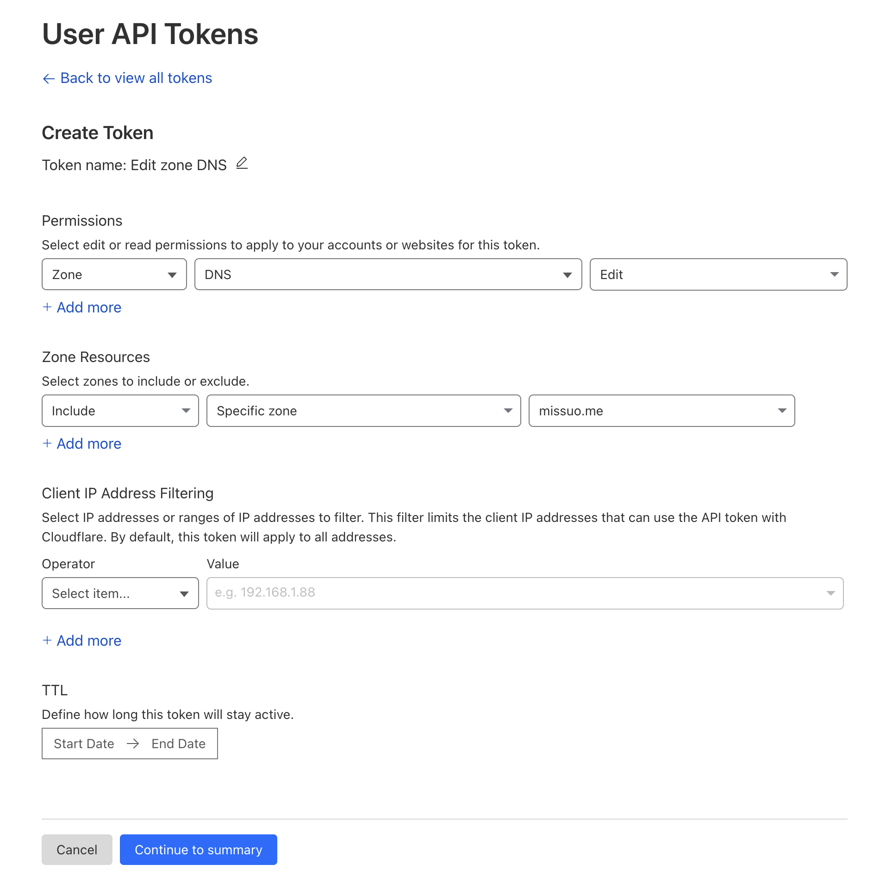

# Cloudflare DDNS for UniFi OS

Provide a UniFi-compatible DDNS API, making it easy for you to dynamically update the IP address of Cloudflare DNS A records on UniFi OS.

## Why?

The official DDNS service provided by UniFi does not support Cloudflare. Prior to this, there was a highly useful version based on Workers. This project has been reconstructed in Go based on [willswire/unifi-ddns](https://github.com/willswire/unifi-ddns), making it convenient for you to use with **Docker** or directly run the **Binary**. 

If you want to deploy using Cloudflare Workers, I highly recommend checking out this repository [willswire/unifi-ddns](https://github.com/willswire/unifi-ddns).

## Usage

### Docker Compose

```bash
mkdir unifi-cloudflare-ddns && cd unifi-cloudflare-ddns
wget -O compose.yaml https://github.com/missuo/unifi-cloudflare-ddns/raw/main/compose.yaml
docker compose up -d
```

### Get the Token from Cloudflare



1. Go to [Cloudflare Dashboard](https://dash.cloudflare.com)
2. Go to **API Tokens** -> **Create Token**
3. Select **Edit Zone DNS**
4. Select **Permissions** -> **Zone** -> **DNS** -> **Edit**
4. Select **Zone Resources** -> **Include** -> **Specific Zone** -> **Your Domain Zone**
6. Click **Continue to summary**
7. Click **Create Token**
8. Copy the token

### Set DDNS on UniFi OS

1. Log in to your [UniFi OS Controller](https://unifi.ui.com/).
2. Navigate to Settings > Internet > WAN and scroll down to **Dynamic DNS**.
3. Click **Create New Dynamic DNS** and provide:
   - `Service`: Choose `custom` or `dyndns`.
   - `Hostname`: Full subdomain and hostname to update (e.g., `subdomain.mydomain.com` or `mydomain.com` for root domain).
   - `Username`: Domain name containing the record (e.g., `mydomain.com`).
   - `Password`: Cloudflare API Token.
   - `Server`: Cloudflare Worker route `YOUR_IP:9909/update?ip=%i&hostname=%h`.
     - For older UniFi devices, omit the URL path.
     - Remove `https://` from the URL.


